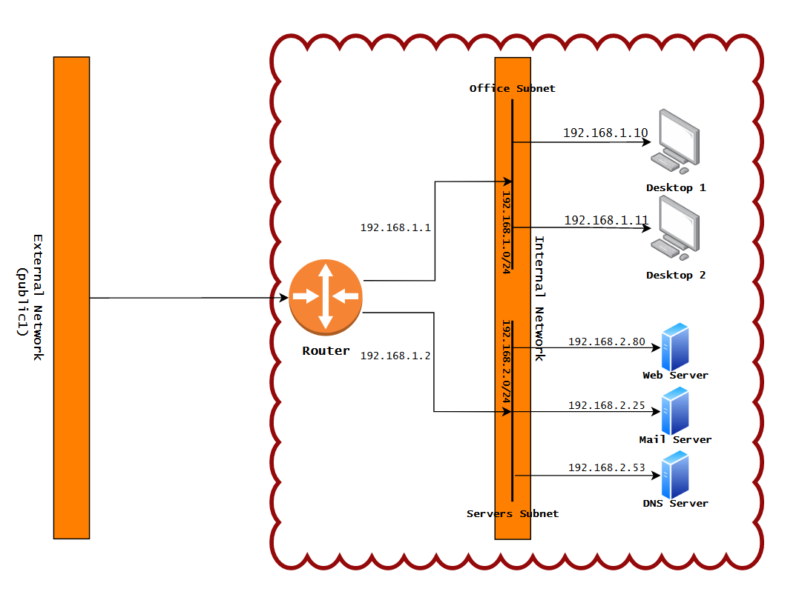

# Terraform deploy DMZ-like infrastructure
Simple terraform project to make a DMZ infrastructure over openstack with 2 subnets (office network and servers network).
* The servers network contains 1 DNS server (CentOS 7), 1 mail server (CentOS 7) and 1 web server (Bionic Ubuntu).

* The office network contains two identical machines (RancherOS).

* Note that the images folder need to be provided with the required **.qcow2** or **.img** files, for the project to work.

The following diagram explains the full architecture that will be made after executing this project over terraform :

